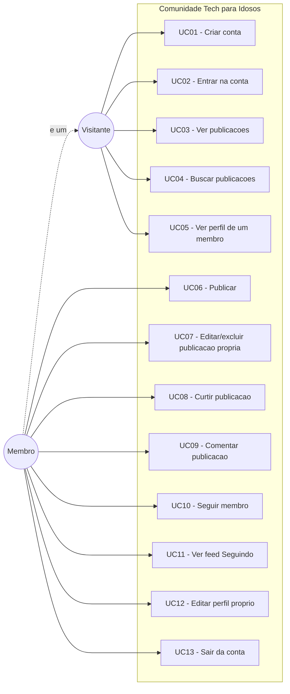

# 1. Escopo do Projeto

## 1.1 Visão geral

A **Comunidade Tech para Idosos** é uma rede social de apoio mútuo para pessoas
idosas que estão aprendendo a usar computador e internet. O objetivo é dar a
esse público um lugar onde possam **tirar dúvidas sem constrangimento**,
**compartilhar o que aprenderam** e **acompanhar outras pessoas** que estão na
mesma jornada.

O projeto nasceu como um módulo de um site de quizzes e jogos educativos
(trabalho de faculdade do curso de Análise e Desenvolvimento de Sistemas) e está
sendo reconstruído como uma **aplicação independente**, com backend próprio em
Java e frontend em HTML, CSS e JavaScript.

## 1.2 Problema

Pessoas idosas que começam a usar tecnologia costumam:

- ter receio de perguntar por medo de "estar incomodando" ou de parecer bobas;
- desistir diante de interfaces densas, com letras pequenas e muitos botões;
- não ter com quem falar sobre as dificuldades do dia a dia.

Redes sociais tradicionais não resolvem isso: são desenhadas para densidade de
informação e engajamento contínuo, não para clareza e calma.

## 1.3 Público-alvo

| Perfil | Descrição | Necessidade principal |
|---|---|---|
| **Primário** | Pessoas 60+ aprendendo a usar computador, celular e internet | Perguntar sem medo e receber resposta em linguagem simples |
| **Secundário** | Familiares, cuidadores e voluntários que ajudam essas pessoas | Responder dúvidas e acompanhar quem apoiam |
| **Terciário** | Instrutores de oficinas de inclusão digital | Um espaço para os alunos continuarem a conversa depois da aula |

## 1.4 Princípios de produto

Estes princípios orientam as decisões de design e de implementação. Havendo
dúvida entre duas alternativas, vence a que respeita mais estes pontos.

1. **Legibilidade acima de densidade.** É melhor mostrar 5 publicações
   confortáveis do que 20 apertadas.
2. **Poucas ações por tela.** Cada tela tem uma tarefa principal óbvia.
3. **Linguagem simples.** Nada de "feed", "timeline" ou "upload" na interface —
   usamos "publicações", "início", "enviar foto".
4. **Erro nunca é culpa do usuário.** As mensagens explicam o que fazer, não o
   que deu errado tecnicamente.
5. **Sem pressa e sem armadilhas.** Nada de rolagem infinita nem de ações
   destrutivas sem confirmação.

## 1.5 Requisitos funcionais

### Conta e acesso

| ID | Requisito | Prioridade |
|---|---|---|
| RF01 | O visitante pode criar uma conta informando nome completo, e-mail e senha | Alta |
| RF02 | O usuário pode entrar na conta com e-mail e senha | Alta |
| RF03 | O usuário permanece conectado entre visitas até sair ou o token expirar | Alta |
| RF04 | O usuário pode sair da conta | Alta |

### Publicações

| ID | Requisito | Prioridade |
|---|---|---|
| RF05 | O membro pode publicar um texto de até 500 caracteres | Alta |
| RF06 | O membro pode anexar uma imagem à publicação | Média |
| RF07 | O membro pode editar as próprias publicações | Alta |
| RF08 | O membro pode excluir as próprias publicações | Alta |
| RF09 | Qualquer pessoa pode ver a lista de publicações, da mais recente para a mais antiga | Alta |
| RF10 | A lista carrega em páginas, com um botão "Ver mais publicações" | Média |

### Interação

| ID | Requisito | Prioridade |
|---|---|---|
| RF11 | O membro pode curtir e descurtir uma publicação | Alta |
| RF12 | O membro pode comentar em uma publicação | Alta |
| RF13 | O membro pode excluir os próprios comentários | Média |
| RF14 | O autor de uma publicação pode excluir qualquer comentário feito nela | Baixa |

### Perfil e conexões

| ID | Requisito | Prioridade |
|---|---|---|
| RF15 | Qualquer pessoa pode ver o perfil público de um membro e suas publicações | Alta |
| RF16 | O membro pode editar o próprio nome, biografia e foto de perfil | Média |
| RF17 | O membro pode seguir e deixar de seguir outros membros | Média |
| RF18 | O membro tem um feed "Seguindo" com publicações de quem ele segue e as próprias | Média |
| RF19 | O perfil mostra a contagem de seguidores e de seguindo | Baixa |

### Busca

| ID | Requisito | Prioridade |
|---|---|---|
| RF20 | Qualquer pessoa pode buscar publicações pelo texto | Média |

## 1.6 Requisitos não funcionais

### Acessibilidade — o requisito mais importante deste projeto

| ID | Requisito |
|---|---|
| RNF01 | Tamanho de fonte base de 18px, com escala em `rem` |
| RNF02 | A interface oferece controle de tamanho de fonte (Normal / Grande / Muito grande), com a escolha lembrada entre visitas |
| RNF03 | Contraste mínimo de 4.5:1 para texto e 3:1 para bordas e ícones (WCAG 2.1 nível AA) |
| RNF04 | Alvos de toque e clique com no mínimo 48x48 pixels |
| RNF05 | Navegação completa por teclado, com indicador de foco sempre visível |
| RNF06 | HTML semântico, `alt` em imagens e rótulos associados a todos os campos de formulário |
| RNF07 | Mensagens de status anunciadas a leitores de tela (`aria-live`) |

### Segurança

| ID | Requisito |
|---|---|
| RNF08 | Senhas armazenadas apenas como hash BCrypt, nunca em texto puro |
| RNF09 | API REST sem estado, autenticada por token JWT no cabeçalho `Authorization` |
| RNF10 | Toda ação de escrita verifica no servidor se o usuário é dono do recurso |
| RNF11 | Todos os dados recebidos são validados no servidor, independentemente da validação feita no cliente |
| RNF12 | Conteúdo gerado por usuário é escapado antes de ir para o HTML (prevenção de XSS) |
| RNF13 | Segredos (senha do banco, chave JWT, chave do Storage) vêm de variáveis de ambiente e nunca são versionados |

### Técnicos e de qualidade

| ID | Requisito |
|---|---|
| RNF14 | Layout responsivo, funcional de 320px a 1440px de largura |
| RNF15 | Imagens limitadas a 3MB, nos formatos JPG, PNG ou WebP |
| RNF16 | Erros da API retornam JSON em formato padronizado, com mensagem em português |
| RNF17 | O frontend não depende de etapa de build — abre direto no navegador |

## 1.7 Regras de negócio

| ID | Regra |
|---|---|
| RN01 | O e-mail é único no sistema |
| RN02 | A senha tem no mínimo 8 caracteres |
| RN03 | Uma publicação precisa ter texto; a imagem é opcional |
| RN04 | Um usuário pode curtir a mesma publicação apenas uma vez |
| RN05 | Um usuário não pode seguir a si mesmo |
| RN06 | Excluir uma publicação exclui também seus comentários e curtidas |
| RN07 | Excluir uma conta exclui todo o conteúdo criado por ela |
| RN08 | Uma publicação editada é marcada visualmente como "editada" |
| RN09 | As publicações são sempre ordenadas da mais recente para a mais antiga |
| RN10 | Visitantes não autenticados podem ler, mas não podem publicar, curtir, comentar nem seguir |

## 1.8 Atores e casos de uso

### Detalhamento dos casos de uso principais

#### UC01 — Criar conta

- **Ator:** Visitante
- **Pré-condição:** Não estar autenticado
- **Fluxo principal:**
  1. O visitante abre a página de cadastro.
  2. Informa nome completo, e-mail e senha.
  3. O sistema valida os dados (RN01, RN02).
  4. O sistema cria a conta com a senha em hash (RNF08).
  5. O sistema autentica o usuário e o leva ao início.
- **Fluxo alternativo A1 — e-mail já cadastrado:** o sistema informa que o
  e-mail já está em uso e oferece o link de login.
- **Pós-condição:** Usuário criado e autenticado.

#### UC06 — Publicar

- **Ator:** Membro
- **Pré-condição:** Estar autenticado
- **Fluxo principal:**
  1. O membro escreve o texto na caixa de publicação.
  2. Opcionalmente escolhe uma imagem, que é pré-visualizada.
  3. Confirma a publicação.
  4. O sistema valida o conteúdo (RN03) e, havendo imagem, a envia ao Storage.
  5. O sistema salva a publicação e ela aparece no topo do início.
- **Fluxo alternativo A1 — texto vazio:** o botão permanece desabilitado e o
  sistema explica que é preciso escrever algo.
- **Fluxo alternativo A2 — imagem grande demais:** o sistema informa o limite de
  3MB antes de enviar (RNF15).

#### UC08 — Curtir publicação

- **Ator:** Membro
- **Pré-condição:** Estar autenticado
- **Fluxo principal:**
  1. O membro aciona o botão de curtir.
  2. O sistema registra a curtida (RN04) e atualiza a contagem imediatamente.
- **Fluxo alternativo A1 — já curtiu:** a mesma ação remove a curtida.
- **Fluxo alternativo A2 — não autenticado:** o sistema convida a entrar na
  conta, preservando a página atual.

## 1.9 Fora de escopo na versão 1

Registrado de propósito, para deixar claro o que foi decidido **não** fazer:

- Mensagens privadas entre membros
- Notificações (em tela ou por e-mail)
- Denúncia de conteúdo e ferramentas de moderação
- Tópicos ou categorias de publicações
- Vídeos e áudios
- Recuperação de senha por e-mail
- Painel administrativo
- Atualização em tempo real (WebSocket)
- Aplicativo mobile nativo
- Múltiplos idiomas

## 1.10 Critérios de conclusão da versão 1

A versão 1 está pronta quando:

- [ ] Todos os requisitos de prioridade **Alta** estão implementados
- [ ] A API está documentada e funcionando ponta a ponta com o frontend
- [ ] O projeto passa em uma verificação de contraste WCAG AA
- [ ] É possível navegar por todas as telas usando apenas o teclado
- [ ] O README explica o projeto e como executá-lo em outra máquina
