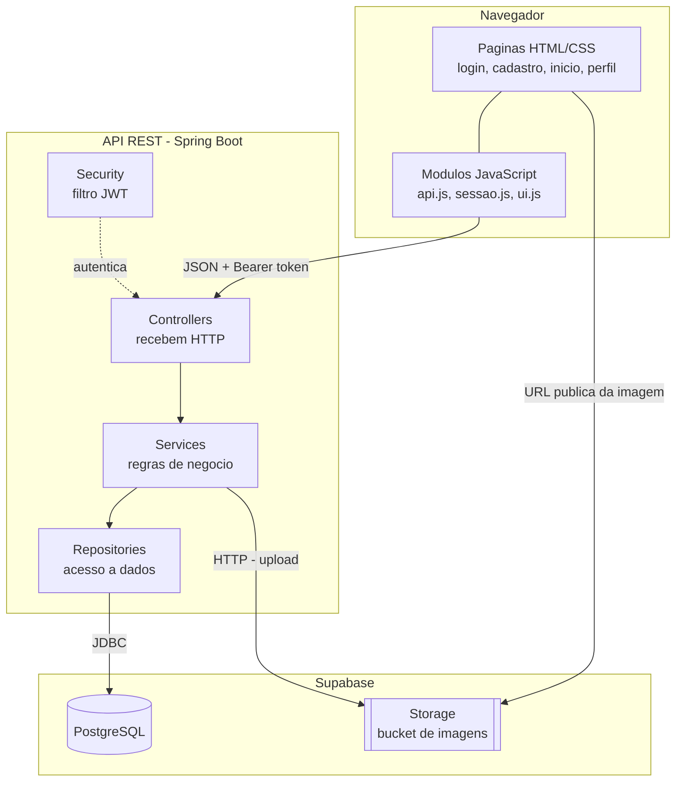
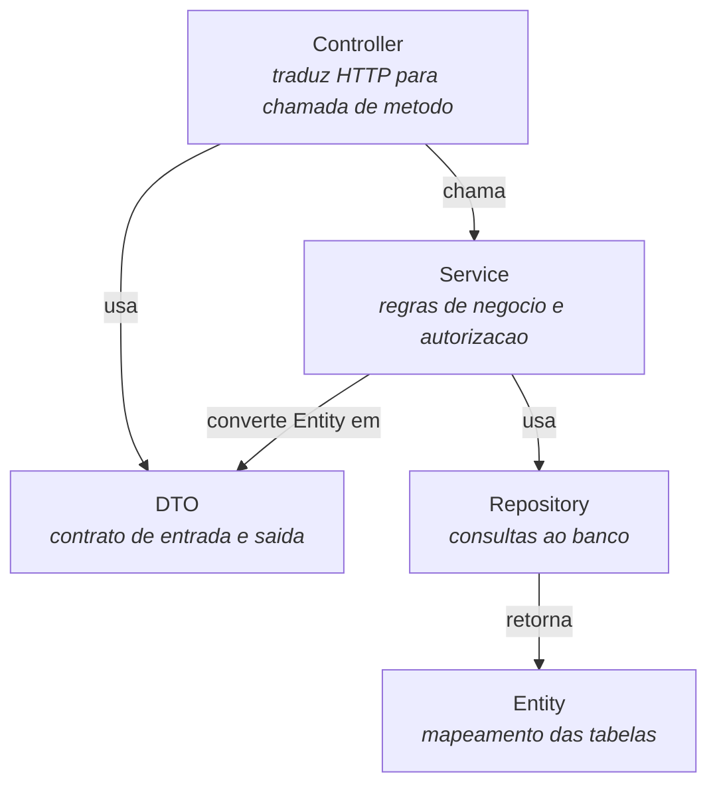
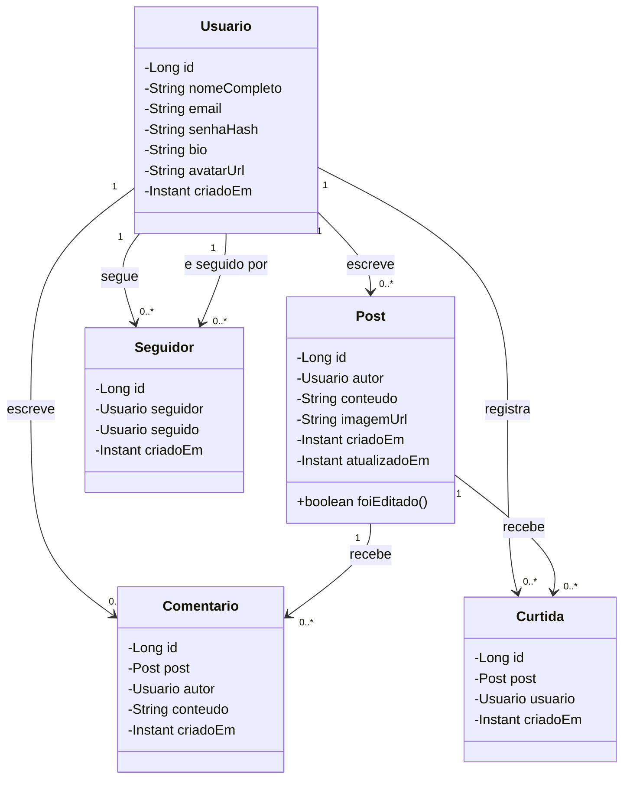
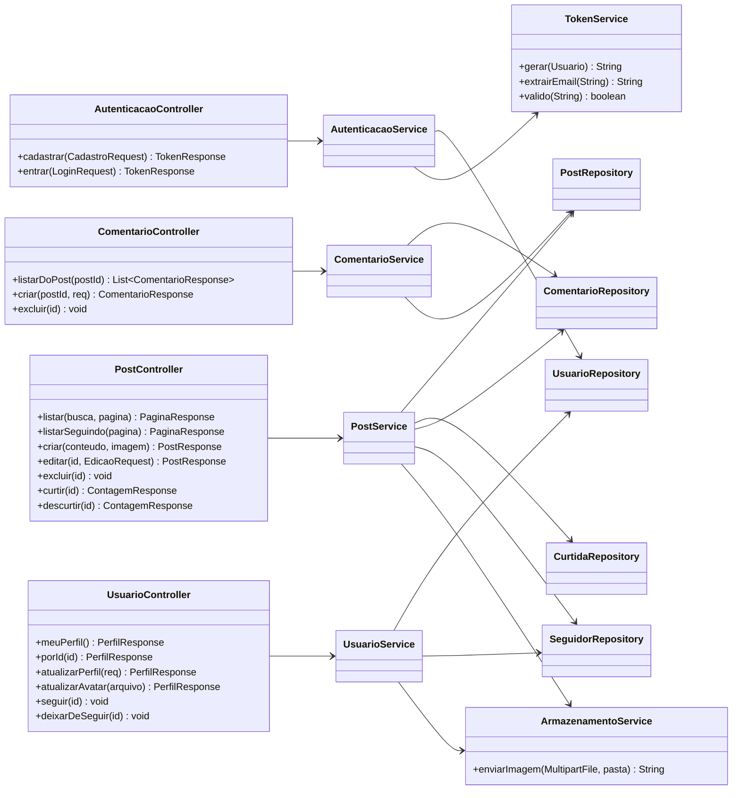
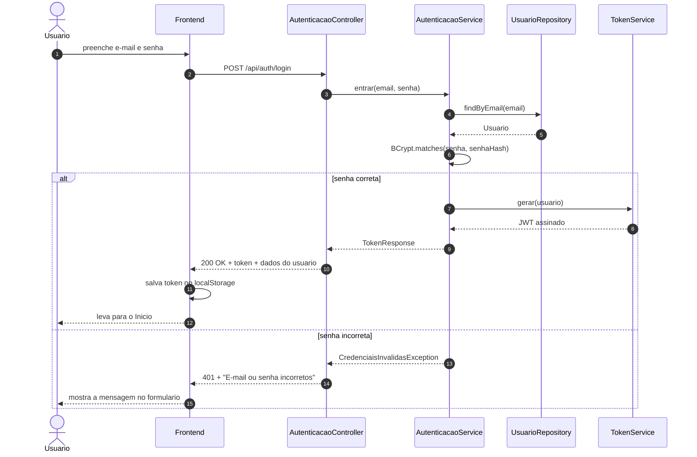
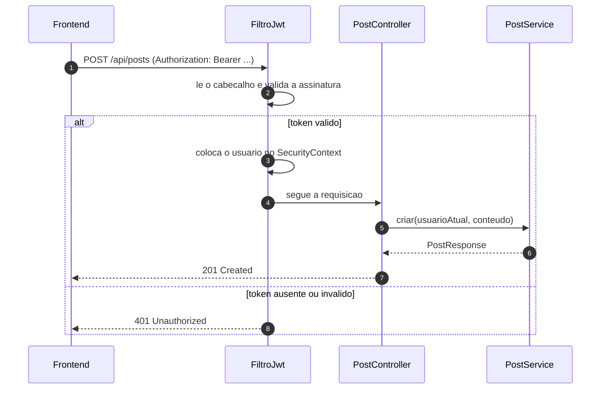
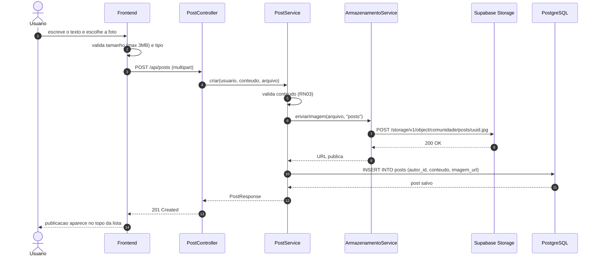

# 2. Arquitetura

## 2.1 Visão geral

A aplicação é dividida em duas partes independentes que se comunicam apenas por
HTTP/JSON:

- **Frontend** — páginas estáticas em HTML, CSS e JavaScript. Não tem etapa de
  build e não conhece o banco de dados. Só sabe conversar com a API.
- **Backend** — uma API REST em Java com Spring Boot. É a única parte que fala
  com o banco e a única que decide o que cada usuário pode fazer.

Essa separação é proposital: o frontend pode ser publicado em qualquer
hospedagem estática e o backend em qualquer servidor Java, sem que um dependa da
infraestrutura do outro.



## 2.2 Organização em camadas

O backend segue a divisão clássica em camadas. Cada camada só conhece a de
baixo, e os dados que atravessam a fronteira HTTP são sempre DTOs — as entidades
JPA nunca são serializadas diretamente.



**Por que DTOs e não as entidades direto:** a entidade `Usuario` guarda o
`senhaHash`. Se ela fosse serializada como resposta JSON, o hash vazaria para o
navegador. O DTO obriga a escolher explicitamente o que sai.

### Responsabilidade de cada camada

| Camada | Faz | Não faz |
|---|---|---|
| Controller | Lê a requisição, chama o service, devolve o status HTTP | Regra de negócio, acesso a banco |
| Service | Valida regras, verifica permissão, orquestra repositórios | Conhecer HTTP (`HttpServletRequest`, status code) |
| Repository | Consulta e grava no banco | Decidir se a operação é permitida |
| Entity | Representa uma tabela | Lógica de aplicação |

## 2.3 Estrutura de pastas

```
comunidade/
├── docs/                      # esta documentação
├── backend/
│   ├── pom.xml
│   └── src/main/
│       ├── java/com/comunidade/
│       │   ├── ComunidadeApplication.java
│       │   ├── config/        # CORS, beans de configuração
│       │   ├── security/      # filtro JWT, geração e validação de token
│       │   ├── model/         # entidades JPA
│       │   ├── repository/    # interfaces Spring Data
│       │   ├── service/       # regras de negócio
│       │   ├── controller/    # endpoints REST
│       │   ├── dto/           # records de entrada e saída
│       │   └── exception/     # exceções e handler global
│       └── resources/
│           ├── application.properties
│           └── db/schema.sql  # modelo documentado em SQL
└── frontend/
    ├── index.html             # início (lista de publicações)
    ├── login.html
    ├── cadastro.html
    ├── perfil.html
    ├── css/
    │   └── style.css
    └── js/
        ├── config.js          # endereço da API
        ├── api.js             # wrapper de fetch com token
        ├── sessao.js          # token e usuário no localStorage
        ├── ui.js              # notificações, modais, datas, escape
        ├── componentes.js     # montagem dos cards
        ├── inicio.js
        ├── login.js
        ├── cadastro.js
        └── perfil.js
```

## 2.4 Diagrama de classes — domínio



`Curtida` e `Seguidor` são tabelas de associação com identidade própria. Poderiam
ser modeladas como `@ManyToMany`, mas viram entidades para que possam guardar a
data em que aconteceram e para deixar as consultas de contagem mais simples.

## 2.5 Diagrama de classes — camadas de serviço

Recorte da camada de aplicação, mostrando as dependências entre os componentes
do backend (omitidos os DTOs para não poluir).



## 2.6 Fluxo de autenticação

O login acontece uma vez; a partir daí toda requisição carrega o token. O
servidor não guarda sessão — ele valida a assinatura do token a cada chamada.



### Requisição autenticada



## 2.7 Fluxo de publicação com imagem



**Por que a imagem não vai para o banco:** a versão original guardava a foto como
Base64 dentro do documento. Isso aumenta o tamanho do registro em cerca de 33%
sobre o arquivo original, torna cada consulta ao feed muito mais pesada e impede
que o navegador use cache de imagem. Guardar o arquivo no Storage e apenas a URL
no banco resolve os três problemas.

## 2.8 Decisões técnicas

| # | Decisão | Alternativas consideradas | Motivo |
|---|---|---|---|
| D01 | **Java 21 + Spring Boot 3** no backend | Node.js/Express, Quarkus | Java é o objetivo de aprendizado; Spring Boot é o padrão de mercado e o que aparece em vagas júnior |
| D02 | **PostgreSQL** (Supabase) | Firebase Firestore, MySQL | O projeto tem relacionamentos claros (autor, comentários, seguidores). Com Firestore, o backend Java viraria um proxy sobre NoSQL, sem JPA nem integridade referencial |
| D03 | **Spring Data JPA** | JDBC puro, MyBatis | Menos código repetitivo para CRUD; JPQL cobre as consultas mais complexas do projeto |
| D04 | **JWT próprio** com Spring Security | Sessão HTTP, Supabase Auth | API sem estado, frontend em outro domínio, e o fluxo completo de autenticação fica visível no código |
| D05 | **Supabase Storage** para imagens | Base64 no banco, disco local | Ver seção 2.7. Disco local quebra em hospedagens de sistema de arquivos efêmero |
| D06 | **Frontend sem build** (HTML + módulos ES6) | React, Vue, Vite | Requisito do projeto; mantém o foco no backend e demonstra JavaScript sem intermediários |
| D07 | **Páginas separadas** em vez de SPA | Roteamento no cliente | Cada tela tem uma URL real, o botão voltar funciona e leitores de tela anunciam a mudança de página — relevante dado o público |
| D08 | **`records` do Java** para os DTOs | Classes com getters, Lombok | Imutáveis, sem boilerplate e sem dependência extra nem configuração de IDE |
| D09 | **Paginação com botão "Ver mais"** | Rolagem infinita | Rolagem infinita desorienta e nunca deixa chegar ao fim da página; o botão dá controle ao usuário |

## 2.9 Tratamento de erros

Todo erro da API sai no mesmo formato, tratado por um `@RestControllerAdvice`
central. Nenhum controller escreve `try/catch` para isso.

```json
{
  "status": 400,
  "erro": "Requisição inválida",
  "mensagem": "A publicação precisa ter algum texto.",
  "campos": {
    "conteudo": "não pode estar em branco"
  },
  "caminho": "/api/posts",
  "momento": "2026-03-14T18:22:41Z"
}
```

| Situação | Exceção | HTTP |
|---|---|---|
| Dados inválidos no corpo | `MethodArgumentNotValidException` | 400 |
| Regra de negócio violada | `RegraDeNegocioException` | 400 |
| Sem token ou token inválido | `AuthenticationException` | 401 |
| Autenticado, mas não é o dono | `AcessoNegadoException` | 403 |
| Recurso não existe | `RecursoNaoEncontradoException` | 404 |
| E-mail já cadastrado | `ConflitoException` | 409 |
| Arquivo acima do limite | `MaxUploadSizeExceededException` | 413 |
| Falha inesperada | `Exception` | 500 |

O `campos` só aparece em erros de validação. A `mensagem` é sempre escrita em
português e em linguagem simples, porque vai direto para a tela do usuário
(princípio 4 da seção 1.4).

## 2.10 Configuração e segredos

Nada sensível entra no repositório. O `application.properties` só referencia
variáveis de ambiente:

```properties
spring.datasource.url=${DB_URL}
spring.datasource.username=${DB_USERNAME}
spring.datasource.password=${DB_PASSWORD}
app.jwt.secret=${JWT_SECRET}
app.storage.service-key=${SUPABASE_SERVICE_KEY}
```

O repositório traz um `.env.example` com os nomes das variáveis e valores de
exemplo. O `.env` real fica no `.gitignore`.

> A chave `service_role` do Supabase ignora as políticas de segurança do banco.
> Ela vive apenas no servidor e **nunca** pode aparecer no frontend.
