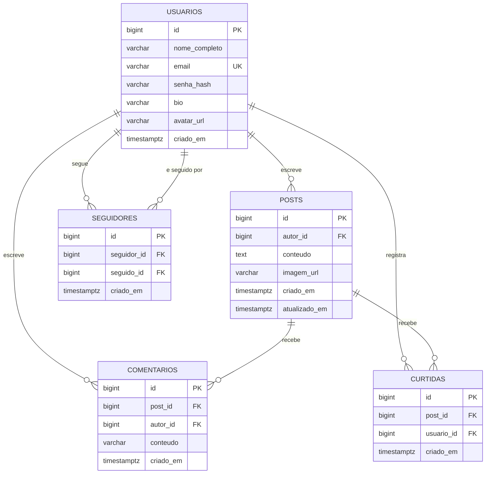

# 3. Modelo de Dados

Banco: **PostgreSQL 15** (instância gerenciada do Supabase).

## 3.1 Diagrama entidade-relacionamento



## 3.2 Dicionário de dados

### `usuarios`

| Coluna | Tipo | Nulo | Descrição |
|---|---|---|---|
| `id` | `bigint` identity | não | Chave primária |
| `nome_completo` | `varchar(120)` | não | Nome exibido nas publicações e no perfil |
| `email` | `varchar(180)` | não | Identificador de login. **Único** (RN01) |
| `senha_hash` | `varchar(255)` | não | Hash BCrypt. Nunca sai da API (RNF08) |
| `bio` | `varchar(280)` | sim | Texto livre de apresentação |
| `avatar_url` | `varchar(500)` | sim | URL pública da foto no Supabase Storage |
| `criado_em` | `timestamptz` | não | Data de criação da conta |

- Índice único: `email`

### `posts`

| Coluna | Tipo | Nulo | Descrição |
|---|---|---|---|
| `id` | `bigint` identity | não | Chave primária |
| `autor_id` | `bigint` | não | FK para `usuarios.id`, `ON DELETE CASCADE` (RN07) |
| `conteudo` | `text` | não | Texto da publicação, até 500 caracteres (validado na aplicação) |
| `imagem_url` | `varchar(500)` | sim | URL pública da imagem, quando houver |
| `criado_em` | `timestamptz` | não | Usado para ordenar o feed (RN09) |
| `atualizado_em` | `timestamptz` | sim | Preenchido só quando o post é editado; se não for nulo, a interface mostra "editada" (RN08) |

- Índices: `criado_em DESC` (ordenação do feed), `autor_id` (posts do perfil)

### `comentarios`

| Coluna | Tipo | Nulo | Descrição |
|---|---|---|---|
| `id` | `bigint` identity | não | Chave primária |
| `post_id` | `bigint` | não | FK para `posts.id`, `ON DELETE CASCADE` (RN06) |
| `autor_id` | `bigint` | não | FK para `usuarios.id`, `ON DELETE CASCADE` |
| `conteudo` | `varchar(500)` | não | Texto do comentário |
| `criado_em` | `timestamptz` | não | Ordenação, do mais antigo para o mais novo |

- Índice: `post_id`

### `curtidas`

| Coluna | Tipo | Nulo | Descrição |
|---|---|---|---|
| `id` | `bigint` identity | não | Chave primária |
| `post_id` | `bigint` | não | FK para `posts.id`, `ON DELETE CASCADE` |
| `usuario_id` | `bigint` | não | FK para `usuarios.id`, `ON DELETE CASCADE` |
| `criado_em` | `timestamptz` | não | Momento da curtida |

- Restrição única: `(post_id, usuario_id)` — garante RN04 **no banco**, não só na
  aplicação. Duas requisições simultâneas do mesmo usuário não conseguem criar
  duas curtidas.

### `seguidores`

| Coluna | Tipo | Nulo | Descrição |
|---|---|---|---|
| `id` | `bigint` identity | não | Chave primária |
| `seguidor_id` | `bigint` | não | Quem segue. FK para `usuarios.id` |
| `seguido_id` | `bigint` | não | Quem é seguido. FK para `usuarios.id` |
| `criado_em` | `timestamptz` | não | Momento em que passou a seguir |

- Restrição única: `(seguidor_id, seguido_id)` — não dá para seguir duas vezes
- Restrição de verificação: `seguidor_id <> seguido_id` — garante RN05 no banco

## 3.3 Notas de modelagem

**Por que contagens não são colunas.** Seria possível guardar
`posts.total_curtidas` e atualizar a cada curtida. Isso é mais rápido de ler, mas
cria um dado que pode ficar dessincronizado. Como o volume esperado é pequeno, as
contagens são calculadas por consulta.

**Como as contagens são consultadas sem N+1.** Buscar cada contagem post a post
geraria uma consulta por publicação da página. Em vez disso, o feed faz uma
única consulta agrupada para todos os IDs da página:

```sql
SELECT post_id, COUNT(*) FROM curtidas WHERE post_id = ANY(:ids) GROUP BY post_id;
```

E o mesmo para comentários. O resultado vira um `Map<Long, Long>` que o service
usa ao montar os DTOs.

**Por que `timestamptz` e não `timestamp`.** O tipo com fuso guarda o instante
absoluto. O servidor grava em UTC e o navegador converte para o horário local do
usuário, o que evita datas erradas se o servidor e o usuário estiverem em fusos
diferentes.

**Herança de exclusão.** Todas as chaves estrangeiras usam `ON DELETE CASCADE`.
Excluir uma publicação leva junto seus comentários e curtidas (RN06); excluir uma
conta leva junto tudo que ela criou (RN07). A integridade fica a cargo do banco,
não de código que pode ser esquecido.

## 3.4 Consultas principais

| Uso | Consulta |
|---|---|
| Feed geral | `SELECT * FROM posts ORDER BY criado_em DESC LIMIT ? OFFSET ?` |
| Busca por texto | `... WHERE conteudo ILIKE '%termo%' ORDER BY criado_em DESC` |
| Posts de um perfil | `... WHERE autor_id = ? ORDER BY criado_em DESC` |
| Feed "Seguindo" | `... WHERE autor_id = :eu OR autor_id IN (SELECT seguido_id FROM seguidores WHERE seguidor_id = :eu)` |
| Já curti? | `SELECT post_id FROM curtidas WHERE usuario_id = :eu AND post_id = ANY(:ids)` |

> A busca usa `ILIKE '%termo%'`, que não aproveita índice. Para o volume desta
> versão isso não é problema; se o projeto crescer, o caminho é a busca em texto
> completo do Postgres (`tsvector` + índice GIN). Registrado como melhoria
> futura, não implementado agora.

## 3.5 Script de criação

O script completo está em
[`backend/src/main/resources/db/schema.sql`](../backend/src/main/resources/db/schema.sql).

Em desenvolvimento, o Hibernate cria as tabelas sozinho
(`spring.jpa.hibernate.ddl-auto=update`). O script existe como documentação do
modelo e para quem preferir criar o schema à mão no SQL Editor do Supabase.
