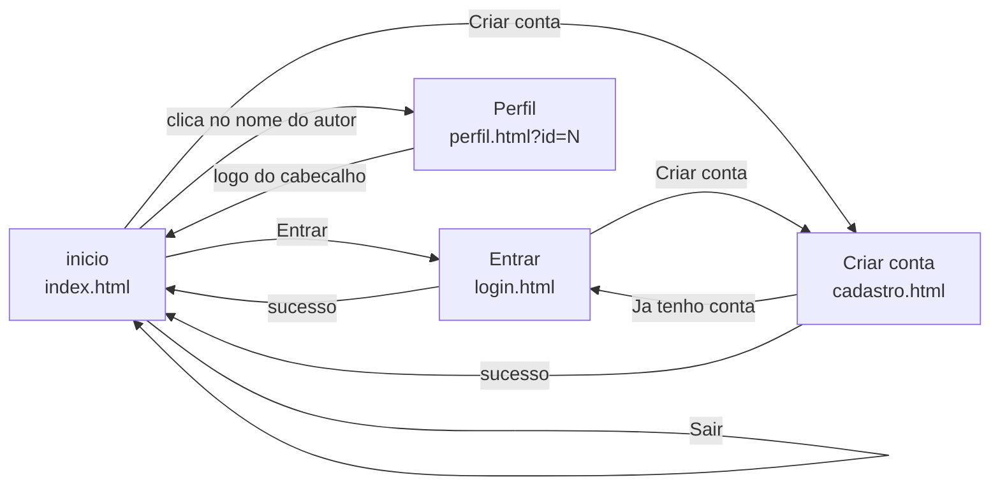

# 5. Design — Guia de Estilo e Wireframes

Este documento é o protótipo do projeto: define a identidade visual, os
componentes e o layout de cada tela. Serve como referência ao escrever o CSS e
como registro das decisões de acessibilidade.

## 5.1 Direção visual

A interface precisa parecer **calma, clara e confiável**. Referência mental: um
formulário de banco bem feito, não um aplicativo de rede social.

| Faz | Não faz |
|---|---|
| Muito espaço em branco entre os blocos | Cards colados, listas densas |
| Um azul sóbrio como única cor de ação | Gradientes, cores neon, múltiplos destaques |
| Texto grande e alto contraste | Cinza claro sobre branco, texto de 12px |
| Botões com rótulo escrito | Botões só com ícone |
| Cantos levemente arredondados | Formas muito arredondadas ou totalmente retas |

**Ícones nunca aparecem sozinhos.** Toda ação tem texto ao lado — "Curtir",
"Comentar", "Enviar foto". Ícone isolado depende de convenção aprendida, e o
público deste projeto está justamente aprendendo essas convenções.

## 5.2 Cores

A paleta parte da que o projeto já usava, com um ajuste importante: o azul
original `#4A90E2` tem contraste de apenas **3.3:1** contra o branco, o que
**reprova no WCAG AA para texto** (mínimo 4.5:1). Ele foi escurecido para uso em
texto e botões, e o tom original ficou reservado para elementos decorativos, onde
o mínimo exigido é 3:1.

### Paleta

| Token | Valor | Uso | Contraste sobre branco |
|---|---|---|---|
| `--cor-primaria` | `#1A5FB4` | Botões principais, links, ícones de ação | **6.3:1** ✅ AA |
| `--cor-primaria-escura` | `#144A8C` | Estado `:hover` e `:active` | 8.5:1 ✅ AAA |
| `--cor-primaria-clara` | `#C0DFFF` | Fundo de estado selecionado, destaque suave | fundo |
| `--cor-decorativa` | `#4A90E2` | Bordas, ilustrações, detalhes não textuais | 3.3:1 ⚠️ só não-texto |
| `--cor-fundo` | `#F0F2F5` | Fundo da página | — |
| `--cor-superficie` | `#FFFFFF` | Cards, cabeçalho, campos | — |
| `--cor-texto` | `#333333` | Texto principal | **12.6:1** ✅ AAA |
| `--cor-texto-suave` | `#5A5A5A` | Datas, contadores, textos de apoio | **6.9:1** ✅ AA |
| `--cor-borda` | `#D0D5DC` | Bordas de campos e separadores | 1.4:1 (decorativa) |
| `--cor-erro` | `#B3261E` | Mensagens de erro, botão de excluir | **6.5:1** ✅ AA |
| `--cor-sucesso` | `#1B6B3A` | Confirmações | **6.6:1** ✅ AA |
| `--cor-foco` | `#1A5FB4` | Contorno de foco do teclado | 6.3:1 ✅ |

> Os valores de contraste foram calculados pela fórmula do WCAG 2.1. Antes de
> fechar a versão 1, revalidar com uma ferramenta (DevTools do navegador ou
> WebAIM Contrast Checker) e registrar o resultado no README.

### Uso da cor

- **A cor nunca é o único indicador.** Uma publicação curtida não muda só de cor:
  o ícone muda de contorno para preenchido e o rótulo muda de "Curtir" para
  "Curtido". Isso atende quem tem daltonismo.
- **Vermelho só para destruição e erro.** Nunca decorativo.
- **Um único azul de ação por tela.** Se tudo é destaque, nada é.

## 5.3 Tipografia

**Família:** Roboto, com fallback para a fonte do sistema.

```css
font-family: 'Roboto', -apple-system, BlinkMacSystemFont, 'Segoe UI',
             Arial, sans-serif;
```

> No código original o CSS pedia Roboto, mas a fonte nunca era carregada — na
> prática o navegador usava a fonte padrão do sistema. Corrigir importando pelo
> Google Fonts, ou assumir a fonte do sistema de propósito e remover Roboto da
> declaração. Optamos por importar.

### Escala — base 18px

| Token | Tamanho | `rem` | Uso |
|---|---|---|---|
| `--fonte-pequena` | 16px | `0.9rem` | Metadados, legendas. **Piso: nada menor que isto** |
| `--fonte-base` | 18px | `1rem` | Corpo de texto, campos, botões |
| `--fonte-media` | 20px | `1.125rem` | Texto da publicação |
| `--fonte-grande` | 23px | `1.25rem` | Nome do autor, título de card |
| `--fonte-titulo` | 27px | `1.5rem` | Título de seção |
| `--fonte-destaque` | 32px | `1.75rem` | Título de página |

Todos os tamanhos em `rem`, calculados a partir do `font-size` do `<html>`.
É isso que faz o controle de tamanho de fonte funcionar com uma linha só.

### Legibilidade

| Propriedade | Valor | Motivo |
|---|---|---|
| `line-height` do corpo | `1.6` | Linhas soltas facilitam a leitura para quem tem visão cansada |
| `line-height` de títulos | `1.3` | Títulos curtos não precisam de tanto respiro |
| Largura máxima de texto | `65ch` | Linhas muito longas fazem o olho perder a próxima linha |
| `font-weight` do corpo | `400` | — |
| `font-weight` de ênfase | `600` | 700 fica pesado demais no tamanho 18px |
| Alinhamento | sempre `left` | Texto justificado cria "rios" de espaço em branco |

### Controle de tamanho de fonte (RNF02)

Três níveis, disponíveis no cabeçalho de todas as páginas e guardados no
`localStorage`:

| Nível | `html { font-size }` | Corpo resultante |
|---|---|---|
| Normal | `18px` | 18px |
| Grande | `21px` | 21px |
| Muito grande | `24px` | 24px |

```
┌───────────────────────────────────┐
│  Tamanho da letra:  [A] [A] [ A ] │
│                      ▲            │
│                 selecionado       │
└───────────────────────────────────┘
```

Os três botões mostram a letra "A" em tamanhos crescentes, com o rótulo
acessível descrito por `aria-label` ("Letra normal", "Letra grande", "Letra muito
grande") e o estado atual em `aria-pressed`.

## 5.4 Espaçamento, formas e sombras

### Escala de espaçamento — base 4px

| Token | Valor | Uso típico |
|---|---|---|
| `--esp-1` | `4px` | Entre ícone e texto |
| `--esp-2` | `8px` | Dentro de elementos pequenos |
| `--esp-3` | `12px` | Padding interno de botão |
| `--esp-4` | `16px` | Padding de campo, espaço entre itens |
| `--esp-5` | `24px` | Padding de card |
| `--esp-6` | `32px` | Entre cards |
| `--esp-7` | `48px` | Entre seções |

### Formas

| Token | Valor | Uso |
|---|---|---|
| `--raio-pequeno` | `6px` | Campos de formulário |
| `--raio-medio` | `10px` | Cards, modais |
| `--raio-pilula` | `999px` | Botões de ação |
| `--raio-circulo` | `50%` | Avatares |

### Sombras

| Token | Valor | Uso |
|---|---|---|
| `--sombra-1` | `0 1px 3px rgba(0,0,0,0.08)` | Cards em repouso |
| `--sombra-2` | `0 2px 8px rgba(0,0,0,0.12)` | Cabeçalho fixo, card em hover |
| `--sombra-3` | `0 8px 24px rgba(0,0,0,0.18)` | Modais |

Sombras discretas. O card se define pela borda e pelo fundo branco sobre o cinza,
não pelo efeito de elevação.

### Alvos de clique (RNF04)

**Mínimo absoluto: 48x48px.** Vale para botões, links de navegação, ícones
clicáveis e itens de menu. Quando o elemento visual for menor, o padding aumenta
a área clicável até o mínimo.

Espaçamento mínimo de `8px` entre dois alvos, para reduzir toque acidental —
importante para quem tem tremor nas mãos.

## 5.5 Componentes

### Botão

Três variantes, uma hierarquia clara por tela.

```
Primário            Secundário          Perigo
┌──────────────┐    ┌──────────────┐    ┌──────────────┐
│  Publicar    │    │  Cancelar    │    │  Excluir     │
└──────────────┘    └──────────────┘    └──────────────┘
 fundo #1A5FB4       fundo branco        fundo branco
 texto branco        borda #1A5FB4       borda #B3261E
                     texto #1A5FB4       texto #B3261E
```

| Estado | Aparência |
|---|---|
| Repouso | Conforme acima |
| `:hover` | Fundo escurece para `--cor-primaria-escura`; cursor `pointer` |
| `:focus-visible` | Contorno de 3px `--cor-foco` com 2px de afastamento |
| `:active` | Deslocamento de 1px para baixo |
| `:disabled` | Opacidade 0.5, cursor `not-allowed`, sem hover |

Altura mínima `48px`, padding `12px 24px`, `font-size: 1rem`, `font-weight: 600`.

### Campo de formulário

```
Nome completo
┌────────────────────────────────────────────┐
│ Maria Aparecida Souza                      │
└────────────────────────────────────────────┘
Como você quer ser chamada na comunidade.

Com erro:
E-mail
┌────────────────────────────────────────────┐
│ maria@                                     │  borda #B3261E, 2px
└────────────────────────────────────────────┘
⚠ Falta completar o e-mail depois do @.
```

- Rótulo **sempre visível acima do campo**, nunca só `placeholder` — o
  placeholder some quando a pessoa começa a digitar e ela perde a referência.
- Texto de ajuda abaixo, quando útil, em `--cor-texto-suave`.
- Mensagem de erro abaixo do campo, com ícone e texto, ligada por
  `aria-describedby`.
- Altura mínima `48px`, padding `12px 16px`.

### Card de publicação

```
┌──────────────────────────────────────────────────────┐
│  ⬤   Maria Aparecida Souza                      ⋮    │
│      há 2 horas · editada                            │
│                                                      │
│  Consegui fazer chamada de vídeo com meus netos      │
│  hoje! Demorei mas deu certo.                        │
│                                                      │
│  ┌────────────────────────────────────────────────┐  │
│  │                  (imagem)                      │  │
│  └────────────────────────────────────────────────┘  │
│                                                      │
│  ────────────────────────────────────────────────    │
│   👍 Curtir  7      💬 Comentar  3                   │
└──────────────────────────────────────────────────────┘
```

- Avatar de `56px`, com as iniciais quando não há foto.
- Nome do autor é link para o perfil, em `--cor-primaria`.
- O menu `⋮` só aparece nas publicações do próprio usuário, com as opções
  "Editar" e "Excluir".
- A data é relativa ("há 2 horas"), com a data completa no atributo `title`.
- "editada" só aparece quando `atualizado_em` não é nulo (RN08).
- Estado curtido: ícone preenchido, rótulo muda para "Curtido", cor
  `--cor-primaria`, fundo `--cor-primaria-clara`.

### Área de comentários

Fica recolhida por padrão e abre ao acionar "Comentar".

```
│  ────────────────────────────────────────────────    │
│   ⬤  João Carlos                                     │
│      Parabéns Maria! Também quero aprender.          │
│      há 1 hora                            Excluir    │
│                                                      │
│   ⬤  ┌──────────────────────────────────┐ ┌───────┐  │
│      │ Escreva um comentário...         │ │Enviar │  │
│      └──────────────────────────────────┘ └───────┘  │
```

### Aviso temporário

Aparece no canto superior direito, some após 4 segundos. Container com
`aria-live="polite"` para que leitores de tela anunciem.

```
┌──────────────────────────────────┐
│ ✓  Publicação criada com sucesso │   sucesso: borda #1B6B3A
└──────────────────────────────────┘
┌──────────────────────────────────┐
│ ⚠  Não foi possível salvar.      │   erro: borda #B3261E
│    Verifique sua internet.       │
└──────────────────────────────────┘
```

Erros não somem sozinhos — trazem botão de fechar, para dar tempo de ler.

### Modal de confirmação

Usado antes de qualquer exclusão (princípio 5 da seção 1.4).

```
        ┌────────────────────────────────────────┐
        │                                     ✕  │
        │   Excluir esta publicação?             │
        │                                        │
        │   Esta ação não pode ser desfeita.     │
        │                                        │
        │   ┌────────────┐  ┌─────────────────┐  │
        │   │  Cancelar  │  │  Sim, excluir   │  │
        │   └────────────┘  └─────────────────┘  │
        └────────────────────────────────────────┘
```

- O foco vai para "Cancelar" ao abrir — a opção segura é a padrão.
- `Esc` fecha, `Tab` circula apenas dentro do modal.
- O fundo escurece com `rgba(0,0,0,0.5)`.

## 5.6 Wireframes das telas

### Cabeçalho (comum a todas as páginas)

```
┌──────────────────────────────────────────────────────────────────┐
│  Comunidade        ┌───────────────────┐        A A A   ⬤ Maria │
│  Tech              │ 🔍 Pesquisar      │                   Sair │
└──────────────────────────────────────────────────────────────────┘
```

Visitante não autenticado vê "Entrar" e "Criar conta" no lugar do avatar.

### Entrar

```
┌──────────────────────────────────────────────────────────────────┐
│                      Comunidade Tech                             │
└──────────────────────────────────────────────────────────────────┘

                  ┌──────────────────────────────┐
                  │                              │
                  │   Entrar na sua conta        │
                  │                              │
                  │   E-mail                     │
                  │   ┌────────────────────────┐ │
                  │   │                        │ │
                  │   └────────────────────────┘ │
                  │                              │
                  │   Senha                      │
                  │   ┌────────────────────────┐ │
                  │   │                  👁 Ver │ │
                  │   └────────────────────────┘ │
                  │                              │
                  │   ┌────────────────────────┐ │
                  │   │        Entrar          │ │
                  │   └────────────────────────┘ │
                  │                              │
                  │   Ainda não tem conta?       │
                  │   Criar minha conta          │
                  │                              │
                  └──────────────────────────────┘
```

O botão "Ver" alterna a visibilidade da senha — quem digita devagar precisa
conferir o que escreveu.

### Criar conta

```
                  ┌──────────────────────────────┐
                  │   Criar sua conta            │
                  │                              │
                  │   Nome completo              │
                  │   ┌────────────────────────┐ │
                  │   └────────────────────────┘ │
                  │   Como você quer ser         │
                  │   chamada na comunidade.     │
                  │                              │
                  │   E-mail                     │
                  │   ┌────────────────────────┐ │
                  │   └────────────────────────┘ │
                  │                              │
                  │   Senha                      │
                  │   ┌────────────────────────┐ │
                  │   │                  👁 Ver │ │
                  │   └────────────────────────┘ │
                  │   Use ao menos 8 letras      │
                  │   ou números.                │
                  │                              │
                  │   ┌────────────────────────┐ │
                  │   │    Criar minha conta   │ │
                  │   └────────────────────────┘ │
                  │                              │
                  │   Já tem conta? Entrar       │
                  └──────────────────────────────┘
```

Sem confirmação de senha: com o botão "Ver" disponível, o campo repetido só
adiciona uma etapa a mais para errar.

### Início — autenticado

```
┌──────────────────────────────────────────────────────────────────┐
│  Cabeçalho                                                       │
└──────────────────────────────────────────────────────────────────┘

  ┌────────────────────────────────────────────────────────────┐
  │  ⬤   Compartilhe uma dúvida ou uma conquista...           │
  │      ┌──────────────────────────────────────────────────┐  │
  │      │                                                  │  │
  │      └──────────────────────────────────────────────────┘  │
  │                                        0/500               │
  │      ┌───────────────┐          ┌──────────────────────┐   │
  │      │ 📷 Enviar foto│          │      Publicar        │   │
  │      └───────────────┘          └──────────────────────┘   │
  └────────────────────────────────────────────────────────────┘

  ┌────────────────────────────────────────────────────────────┐
  │   [ Todas as publicações ]   [ De quem eu sigo ]           │
  └────────────────────────────────────────────────────────────┘

  ┌────────────────────────────────────────────────────────────┐
  │  Card de publicação                                        │
  └────────────────────────────────────────────────────────────┘

  ┌────────────────────────────────────────────────────────────┐
  │  Card de publicação                                        │
  └────────────────────────────────────────────────────────────┘

              ┌──────────────────────────────────┐
              │     Ver mais publicações         │
              └──────────────────────────────────┘
```

### Início — visitante

A caixa de publicar dá lugar a um convite. As publicações continuam visíveis
(RN10) — a pessoa entende o que é a comunidade antes de decidir entrar.

```
  ┌────────────────────────────────────────────────────────────┐
  │   Bem-vindo à Comunidade Tech                              │
  │                                                            │
  │   Um lugar para tirar dúvidas sobre computador e           │
  │   internet, sem pressa e sem julgamento.                   │
  │                                                            │
  │   ┌──────────────────────┐   ┌──────────────────────────┐  │
  │   │  Criar minha conta   │   │  Já tenho conta          │  │
  │   └──────────────────────┘   └──────────────────────────┘  │
  └────────────────────────────────────────────────────────────┘
```

### Resultado de busca

```
  ┌────────────────────────────────────────────────────────────┐
  │   4 publicações encontradas para "wi-fi"      Limpar busca │
  └────────────────────────────────────────────────────────────┘
```

Nada encontrado:

```
  ┌────────────────────────────────────────────────────────────┐
  │                                                            │
  │   Nenhuma publicação fala sobre "wi-fi" ainda.             │
  │                                                            │
  │   Que tal ser a primeira pessoa a perguntar sobre isso?    │
  │                                                            │
  │              ┌──────────────────────────────┐              │
  │              │   Escrever uma publicação    │              │
  │              └──────────────────────────────┘              │
  └────────────────────────────────────────────────────────────┘
```

### Perfil

```
  ┌────────────────────────────────────────────────────────────┐
  │                                                            │
  │      ⬤⬤⬤        Maria Aparecida Souza                     │
  │      ⬤⬤⬤                                                  │
  │      ⬤⬤⬤        Aprendendo a mexer no computador          │
  │                  aos 68 anos. Sem pressa!                  │
  │                                                            │
  │                  12 publicações · 4 seguidores ·           │
  │                  9 seguindo                                │
  │                                                            │
  │                  Na comunidade desde janeiro de 2026       │
  │                                                            │
  │                  ┌────────────────────┐                    │
  │                  │      Seguir        │                    │
  │                  └────────────────────┘                    │
  └────────────────────────────────────────────────────────────┘

  Publicações de Maria
  ┌────────────────────────────────────────────────────────────┐
  │  Card de publicação                                        │
  └────────────────────────────────────────────────────────────┘
```

No próprio perfil, o botão "Seguir" é substituído por "Editar meu perfil", que
abre os campos de nome, biografia e foto na própria página.

### Layout responsivo

| Faixa | Comportamento |
|---|---|
| Até 600px | Coluna única, margem lateral de 16px, cabeçalho com busca recolhida em ícone |
| 601px a 900px | Coluna única centralizada, largura máxima 600px |
| Acima de 900px | Coluna centralizada de 680px; o restante fica em branco de propósito |

Não há layout de três colunas. Barra lateral com sugestões e "assuntos do
momento" é exatamente o tipo de densidade que o princípio 1 rejeita.

```
Celular (375px)              Computador (1280px)
┌─────────────────┐          ┌───────────────────────────────────┐
│ ☰  Comunidade 🔍│          │  Comunidade    [busca]    A A A ⬤ │
├─────────────────┤          ├───────────────────────────────────┤
│ ┌─────────────┐ │          │        ┌─────────────────┐        │
│ │ Publicar    │ │          │        │    Publicar     │        │
│ └─────────────┘ │          │        └─────────────────┘        │
│ ┌─────────────┐ │          │        ┌─────────────────┐        │
│ │ Publicação  │ │          │        │   Publicação    │        │
│ └─────────────┘ │          │        └─────────────────┘        │
│ ┌─────────────┐ │          │        ┌─────────────────┐        │
│ │ Publicação  │ │          │        │   Publicação    │        │
│ └─────────────┘ │          │        └─────────────────┘        │
└─────────────────┘          └───────────────────────────────────┘
```

## 5.7 Fluxo de navegação



Toda página é alcançável em no máximo dois cliques a partir do início.

## 5.8 Microtexto

A linguagem faz parte do design. Padrão adotado:

| Em vez de | Escrever |
|---|---|
| "Feed" | "Início" |
| "Upload de imagem" | "Enviar foto" |
| "Post" | "Publicação" |
| "Login" | "Entrar" |
| "Sign up" / "Registrar" | "Criar minha conta" |
| "Logout" | "Sair" |
| "Erro 500" | "Algo deu errado do nosso lado. Tente de novo em instantes." |
| "Credenciais inválidas" | "E-mail ou senha incorretos." |
| "Campo obrigatório" | "Precisamos do seu nome para continuar." |
| "Nenhum resultado" | "Ainda não há publicações sobre isso." |

## 5.9 Checklist de acessibilidade

Verificar antes de fechar a versão 1:

- [ ] Todo texto atinge 4.5:1 de contraste; bordas e ícones, 3:1
- [ ] Nenhuma fonte abaixo de 16px
- [ ] Todos os alvos de clique com pelo menos 48x48px
- [ ] Todo campo tem `<label>` associado por `for`/`id`
- [ ] Toda imagem tem `alt` descritivo (ou `alt=""` se for decorativa)
- [ ] O foco do teclado é visível em todos os elementos interativos
- [ ] A ordem de tabulação segue a ordem visual
- [ ] Modais prendem o foco e fecham com `Esc`
- [ ] Avisos ficam em container `aria-live`
- [ ] A página usa `<header>`, `<main>`, `<nav>`, `<article>`, `<footer>`
- [ ] Existe link "Pular para o conteúdo" no início da página
- [ ] O site funciona com zoom de 200% sem rolagem horizontal
- [ ] Nenhuma informação é transmitida apenas por cor
- [ ] `<html lang="pt-BR">` em todas as páginas

## 5.10 Tokens em CSS

Ponto de partida do `frontend/css/style.css`:

```css
:root {
  /* Cores */
  --cor-primaria:        #1A5FB4;
  --cor-primaria-escura: #144A8C;
  --cor-primaria-clara:  #C0DFFF;
  --cor-decorativa:      #4A90E2;
  --cor-fundo:           #F0F2F5;
  --cor-superficie:      #FFFFFF;
  --cor-texto:           #333333;
  --cor-texto-suave:     #5A5A5A;
  --cor-borda:           #D0D5DC;
  --cor-erro:            #B3261E;
  --cor-sucesso:         #1B6B3A;
  --cor-foco:            #1A5FB4;

  /* Tipografia */
  --fonte: 'Roboto', -apple-system, BlinkMacSystemFont, 'Segoe UI', Arial, sans-serif;
  --fonte-pequena:  0.9rem;
  --fonte-base:     1rem;
  --fonte-media:    1.125rem;
  --fonte-grande:   1.25rem;
  --fonte-titulo:   1.5rem;
  --fonte-destaque: 1.75rem;

  /* Espaçamento */
  --esp-1: 4px;  --esp-2: 8px;  --esp-3: 12px; --esp-4: 16px;
  --esp-5: 24px; --esp-6: 32px; --esp-7: 48px;

  /* Formas */
  --raio-pequeno: 6px;
  --raio-medio:   10px;
  --raio-pilula:  999px;

  /* Sombras */
  --sombra-1: 0 1px 3px rgba(0, 0, 0, 0.08);
  --sombra-2: 0 2px 8px rgba(0, 0, 0, 0.12);
  --sombra-3: 0 8px 24px rgba(0, 0, 0, 0.18);

  /* Medidas */
  --alvo-minimo:  48px;
  --largura-coluna: 680px;
}

/* Controle de tamanho de fonte (RNF02) */
html                          { font-size: 18px; }
html[data-fonte="grande"]     { font-size: 21px; }
html[data-fonte="muitogrande"]{ font-size: 24px; }

/* Foco sempre visível (RNF05) */
:focus-visible {
  outline: 3px solid var(--cor-foco);
  outline-offset: 2px;
}

/* Respeita quem prefere menos animação */
@media (prefers-reduced-motion: reduce) {
  *, *::before, *::after {
    animation-duration: 0.01ms !important;
    transition-duration: 0.01ms !important;
  }
}
```
